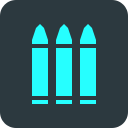

KITSUNETSUKI SDK
================


What's Inside
-------------

*  Bullet Physics SDK (prebuilt with headers included)
*  Panda3D Game Engine (prebuilt with headers included)
*  KITSUNETSUKI Character Controller
* Render Pipeline (with native lighting manager enabled)
* Blender (as a Python module)
* YABEE (standalone version)


Files and directories structure
-------------------------------

* conda - conda package recipes for anaconda/miniconda
* README.md - this file
* ksdk.yml - conda environment file


SDK Requirements
----------------

You have to install those software packages to use the prebuild SDK.

* Anaconda3 or Miniconda3 (version 4.5.11, Python 3.7) - https://conda.io/en/latest/miniconda.html


Installation
------------

```
conda env create kitsune.one/ksdk
conda activate ksdk
```


Uninstallation
------------

```
conda deactivate
conda env remove -n ksdk
```


Building Requirements (Windows)
-------------------------------

You have to install those software packages if you want to modify and build your own SDK.

* Visual Studio 2013 Community
* Visual Studio Build Tools 2017


Building Requirements (Linux)
-----------------------------

You have to install those software packages if you want to modify and build your own SDK.

* GLU
* MESA
* NVIDIA CG
* Ogg
* OpenAL
* Vorbis
* XV
